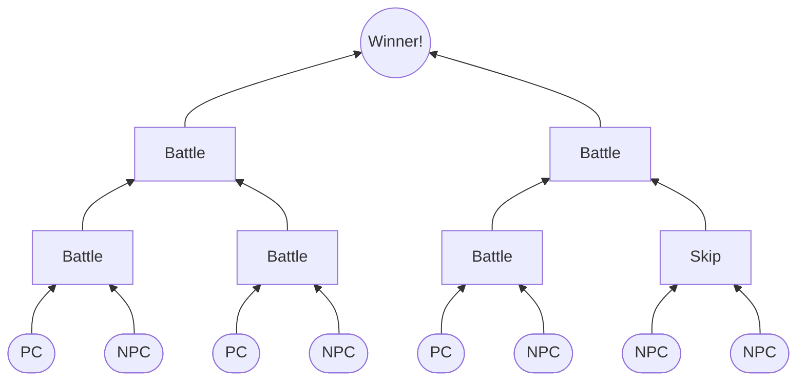
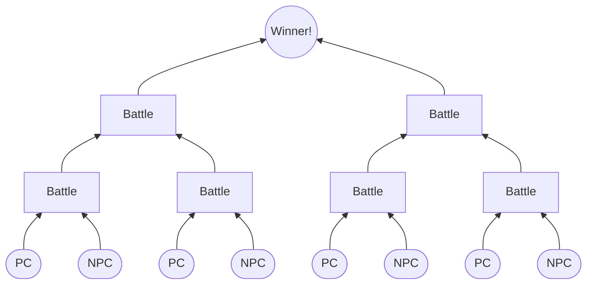
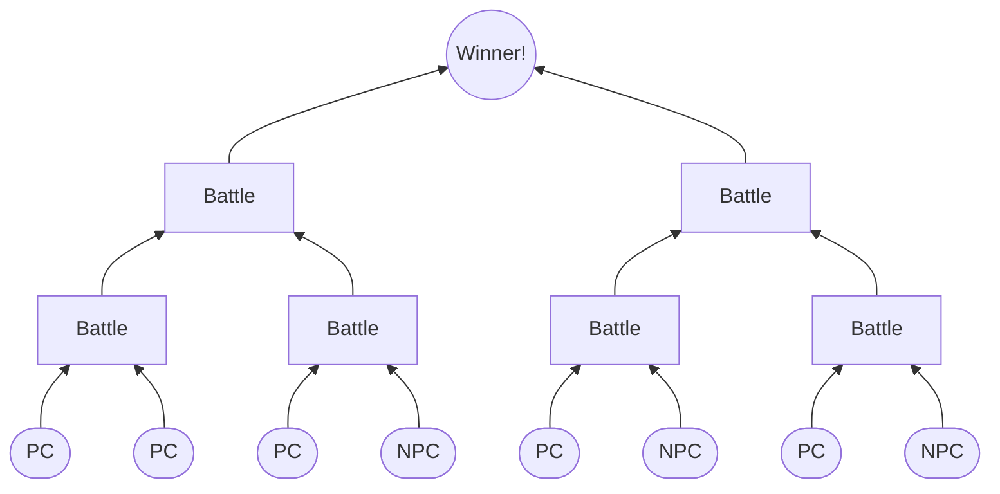

---
categories:
- Pokerole
- Module
doku: Pokexplorers
tags: rpgs modules pokerole
---
#pokexplorers/campaign 

# 3 Players

```mermaid
graph BT

1([PC])
2([PC])
3([PC])
4([NPC])
5([NPC])
6([NPC])
7([NPC])
8([NPC])

1 & 5 --> 10[Battle]
2 & 6 --> 11[Battle]
3 & 7 --> 12[Battle]
4 & 8 --> 13[Skip]
10 & 11 --> 20[Battle]
12 & 13 --> 21[Battle]
20 & 21 --> x((Winner!))
```

# 4 Players

```mermaid
graph BT

1([PC])
2([PC])
3([PC])
4([PC])
5([NPC])
6([NPC])
7([NPC])
8([NPC])

1 & 5 --> 10[Battle]
2 & 6 --> 11[Battle]
3 & 7 --> 12[Battle]
4 & 8 --> 13[Battle]
10 & 11 --> 20[Battle]
12 & 13 --> 21[Battle]
20 & 21 --> x((Winner!))
```

# 5 Players

```mermaid
graph BT

1([PC])
2([PC])
3([PC])
4([PC])
5([PC])
6([NPC])
7([NPC])
8([NPC])

1 & 5 --> 10[Battle]
2 & 6 --> 11[Battle]
3 & 7 --> 12[Battle]
4 & 8 --> 13[Battle]
10 & 11 --> 20[Battle]
12 & 13 --> 21[Battle]
20 & 21 --> x((Winner!))
```