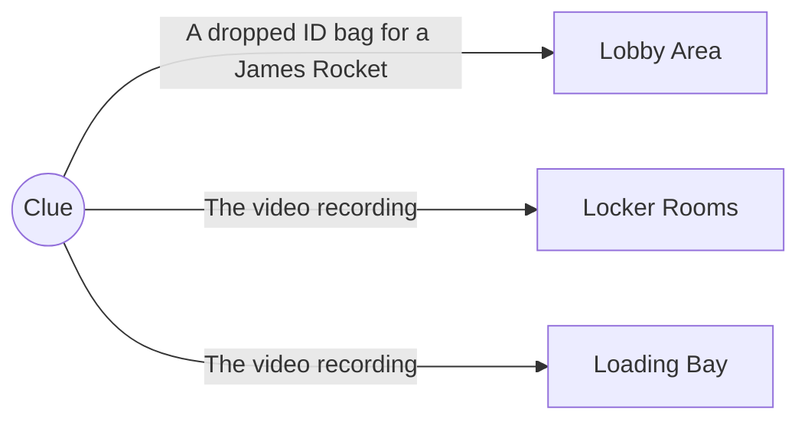
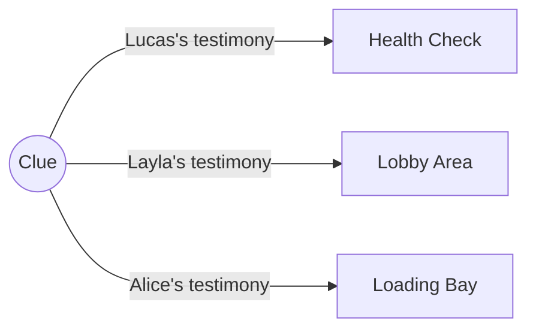
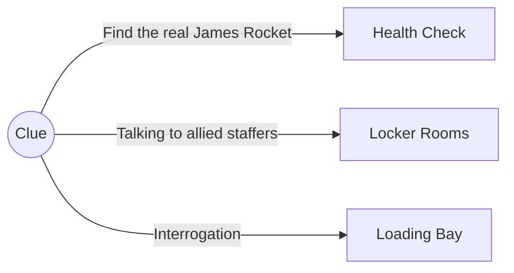

---
categories:
- Pokerole
- Modules
doku: ShadowsOverTheStadium
tags: rpgs modules pokerole
---
# Goldenrod Stadium

> "Welcome to the first ever International Star Tournament! This popular format of pokemon battling started in the Galar region, where teams of two trainers battle against one another, having to coordinate closely with their partners! The format is so popular we here in Johto have built our own Galarian style gym just to support it!"
> "History lesson aside, let's get started! Our first team considers of Alan and Elina, a duo that specialize in total opposites, Fire and Ice! They're opponents are Remington and Annabelle, both serious fighters for a legacy family! Without further ado, they release their Pokemon for-"
> *Hushed voice* "Oh my god, are those? No way, they can't be, Shadow Pokemon?!"

> The four Pokemon each cry out in a guteral, hateful way only a wounded soul could before blasting attacks absolutely everywhere. The crowd runs for the exits, the pokemon's trainers desperately try to reach out to their pokemon, all except for Annabelle who falls to her knees in shock. The shield generator around the pitch is hit with a stray attack and all of a sudden everyone's in the splash zone. League staff can't get to the pitch through the fleeing crowds and it's immediately apparent to you that those trainers down there are in danger!

---

> Each of you are in the stands of the pitch as the shields go down. 
> 
> - Did anyone come together? 
> - Are you nearby each other? 
> - What brought you to attend this tournament? 
{: .prompt-tip }
## The Pitch

The PCs begin in the stands of the Golden Stadium. The Stadium pitch is larger than a football field, close to 200 yards long end to long and 50 yards on the short end. It is similarly oval shaped and filled with stands that surround it.

> Getting to the Pitch
> 
> - **Immediately act:** PCs may hop over the wall and take 1 HP of damage from the fall. If they do so, their trainer can interact immediately with the rest of the pitch.
> - **One turn:** In the chaos of the Shadow Pokemon's rampage, the sides of the pitch have been damaged. In various areas, the walls have collapsed and sections of the seats have slide down into a big pile of rubble. The rubble can be climbed with `Dexterity+Athletics`, though if the check is failed the rubble comes loose and hits the climber for 1 HP of damage. 
> - **Two turns:** PCs can burn an additional turn running to the nearest stairs and descending safely. (They may however throw a pokeball into the general vicinity of the battle with a `Dexterity+Throw`.)
> - *Feel free to award good use of a pokemon's talents with entering the battle area immediately.*
{: .prompt-tip }
Start the battle once everyone has reached the pitch. 

> Versus Shadow Pokemon
> 
> | Trainer   | Pokemon   |
> | --------- | --------- |
> | Alan      | [SotS Charizard]() |
> | Elina     | [SotS Beartic]()   |
> | Remington | [SotS Gengar]()    |
> | Annabelle | [SotS Luxray]()    | 
> 
> - On the pitch are the four Shadow Pokemon along with their trainers, Annabelle, Remington, Alan, and Elina. All but Annabelle are near their respective pokemon, trying to calm them down. Annabelle has fallen to her knees in shock. 
> - Asides from Annabelle, each trainer will have to be convinced to leave their Pokemon to be fought and KO'd by the others. This can be done with `Social+Empathy`. Annabelle simply needs to be moved to safety. None of the trainers know how this happened to their pokemon. 
> - All the shadow pokemon attack for lethal when possible and will go after trainers if no pokemon engages them. They battle until they are KO'd without stopping. 
{: .prompt-tip }
# Debrief

As the players wrap up the encounter with the shadow Pokemon, league staff appears and whisks them, along with the pokemon's trainers, into a side passage. A door is unlocked to allow them through and they enter a small room. Asides from the league staffer, there's an older man here. He speaks to the trainers first.

> **Charles** "Children, my name is Charles and I'm one of the people in charge of this event. I'm sure you must be scared for your partners, but can you tell me more about what happened?"
> **Alan** "We gave our pokemon to the health check station and then we were told our pokeballs would be returned to us in the locker room. They were, but... then..."
> **Charles** "Thank you Alan, I understand. Please, look after Miss Annabelle and stay here where it's safe. We've sealed off the stadium to ensure the perpetrators of this crime don't escape, but afterwards we'll contact Orre's experts on the shadow process to help your partners."

> Charles turns to you and the assembled staffers. "Bonnie, Peter, Spencer, Gus, Richard, I've worked with you for years and trust you implicitly. As for the group of you," he says to you, "I can't imagine you would have fought as hard as you did for these kids if you were involved in this. I'm not sure who we can trust in this scenario but what I do know is that we must find the culprit before they escape. The events earlier were broadcasted across the globe and cannot be allowed to stand."
> 
> "I believe there are a few things we must investigate. These first three would be best for your group to handle."
> 
> "The first, we must investigate what happened in the the health check station. I believe a stray attack caused the hallway leading to it to collapse though, so it may require some careful exploring."
> 
> "The second, we must investigate the locker rooms and get further testimony from other contestants. As they were not first up, the process for the health check may have been different for them and give us more clues."
> 
> "Finally, we sadly must investigate our own people. I'm positive that this couldn't have been done without an inside man or woman. We'll need to observe the staff mixed in with the attendees upstairs and look for signs of trouble."
> 
"Any questions?"

The players can investigate in order. Each location to investigate has clues that will lead to the other locations, as well as one leading to the loading docks. They aren't required to find all the clues and if they make logically jumps to the docks, let them jump ahead.

## The Health Check Station

> True to Charles's word, the hallway leading to the health check station is completely destroyed. Seats and concreate fill the hallway and are simply impossible to pass the way they are.

> Getting Through
> 
> - A pokemon can use a move to find a way around it.
> - `Strength+Athletics` can be used to move rubble in an attempt to free a way in. Need # of players consecutive successes to make a path that requires a `Dexterity+Alert` check to wiggle through. Any total failures cause 1 HP of damage.
> - `Clever+Alert` There's a skylight from the rubble into the room. With a `Dexterity+Athletics` check, a player can drop into the room safely. Getting out without preparations will require a `Dexterity+Athleticsx2`.
{: .prompt-tip }
---

> You find the health check station in a similar state of damage as the hallway leading to it. Most of the computer based equipment is broken, as is the pokeball quick healing machine. A single security camera blinks in the upper corner of the room, somehow still recording the sole computer that's still function, if a little cracked. There are papers and documents strewn everywhere.

> Clue Read Outs
> - **Clue 1** Among the papers you find an ID badge with a broken lanyard, it must have been lost by one of the staffers here. The name on the badge is James Rocket.
> - **Clue 2** Connecting to the video camera footage, you see a blonde boy with a bracelet tattoo enter the room and speak to two of the staffers there. The blonde tentatively hands over a pokeball with express instructions to the unidentifiable staffer.
> - **Clue 3** The video recording around the time of the shadow pokemon outbreak shows the two staffers in the room grabbing all the pokeballs and shoving them into orange gatorade containers. They hurry them off out the room as the room collapses around them. 
{: .prompt-tip }
## The Locker Rooms

> The locker rooms survived mostly undamaged, despite their proximity to the fighting. Inside are two dozen preteen trainers, all anxiously hoping to be reunited safely with their pokemon. 

> Lucas
> 
> - Blonde boy with a tattoo of a bracelet on his arm
> - Very worried about his Trevanant
> - **Clue 1** Says that the health check staff seemed unusually dismissive of his pokemon's special needs (quiet room when checked over, no bright lights).
> 
{: .prompt-tip }
> Layla
> 
> - Brunette, galarian style uniform
> - Wants to go search for her pokemon herself, but has been told it's too dangerous and she must shelter in place.
> - **Clue 2** Mentions she saw staffers carting gatorade around and "it's clearly not that dangerous"
> 
{: .prompt-tip }
> Alice
> 
> - Black hair, galaxy print dress
> - Younger than the rest, sniffling. `Social+Empathy` to calm her down. 
> - **Clue 3** If calmed down, she openly wonders why the staffers were headed down to the loading docks.
> 
{: .prompt-tip }
## The Concession Area

> The main lobby of the Arena is filled to the brim with attendees of the tournament. Some particularly vocal ones are arguing with league staff at the front by the doors, while most are milling about nervously. On the inside wall opposite the door is the main concession stand. It's not operating, but people are still milling about it since it's out of the way of the larger crowd. 

There are various league staffers in the area to be observed. They can be observed via `Insight+Alert`, though without first blending in via `Dexterity+Stealth`, the staffers will notice them.

- Staffers watching the doors to prevent any rough housing trying to get out through the security shutters
- Staffers handing out water to attendees and trying to calm people
- Staffers watch the perimeter for trouble.

Conversation with any group of staffers will be short reasons, all of them are stressed and being yelled at so they aren't in the mood for small talk. On a failed stealth check, the staffers will actually investigate the players and start asking questions of them for the same suspicion. 

Speaking to any of the clean staffers about the party's investigation will lead them to say the following as Clue 2.

> **Clue 2** I don't think you'll find much information about what went down up here. I'd check with the other contestants, it's their pokemon that were messed with. 

The last batch (watching the perimeter) are suspicious upon successful observation. further observation (same mechanic) will reveal they keep looking over at the back room of the concession stand. Any mention of James Rocket in ear shot of them will allow the players to skip the observation as the dirty staffers become very obvious in their checks of the door. 

Inside the back room is Clue 1, however the door is locked. It can be forced open via pokemon, `Dexterity+Athletic`, or opened via `Dexterity+Crafts` via picking. Alternatively, they can get the key from one of the trustworthy staffer groups.

> **Clue 1** When you open the door you see a man tied up in his boxers among the supplies! He muffles out something that sounds like help. Once the gag is removed, he says he's James Rocket and some goons stole his ID card so they could get to the health check room. 

He then asks what happened, as he's been in here since the start. When he leaves the store room, he identifies the dirty staffers as "those are they guys that stole my uniform!". The other staffers are all drawn to attention and the dirty ones surrender. 

The dirty staffers can be interrogated via `Social+Empathy` with a forgiving and understanding angle or `Tough+Intimidate` for an aggressive angle. On three successes in one direction, the staffers admit to clue 3. 

> **Clue 3** Look, what your looking for is in the loading dock. They didn't tell us the whole plan, just what we had to do and we did it. The loading dock was supposed to be our way out when we got a call on this beeper. That's all I know.

# The Loading Dock

> The loading dock is accessed via a large freight elevator that is, somehow, undamaged in the attack. It rolls smoothly down multiple floors until it comes to a stop at the bottom floor, the loading dock. 
> The loading dock is exactly as one would expect, a primarily concrete area with various trucks parked inside. One delivery style truck is open, with multiple gatorade containers inside. More importantly, a Rhyperior is attempting to drill it's way through the security shutters right beside the truck!

---

> From around the side of the truck steps a familiar face, Charles from the Pokemon League! He says "You... Didn't I send you lot on a wild goose chase? Stay back, if you know what's good for you."

> What Charles Knows
> 
> - Charles has always been a spy for Team Rocket. Team Cipher contacted him and flipped him. 
> - The health check was easy enough to replace with the new High Speed Shadow Machine, which he has in the truck.
> - He has all of the challenger's pokemon in the gatorade containers, all of them now shadow pokemon. 
> 
{: .prompt-tip }
Any attempt to approach Charles prompts him to release shadow pokemon at the players from his coat pockets.

### The Loading Dock

> Versus Charles!
> 
> | Shadow Pokemon | Pokemon       |
> | -------------- | ------------- |
> | [SotS Infernape]()  | [SotS Rhyperior]() |
> | [SotS Gothitelle]() |               | 
> | [SotS Grimmsnarl]() |               |
> | [SotS Scizor]()     |               |
> 
> - The enclosed area has little in the way of cover besides various trucks of different sizes. 
> - The Rhyperior continues to drill into the wall if not engaged in combat. After 5 Rounds, The Rhyperior busts through the wall and Charles escapes in the truck the next round. He leaves the shadow pokemon behind, only taking Rhyperior. 
> - The shadow pokemon stand between the Rhyperior and Charles and the players, but aren't protecting them. If a player or their pokemon can stand the hits from each of the shadow pokemon, they can get through and the shadow pokemon won't follow. 
>     - Players can retrieve the pokeballs from Charles to recall a shadow pokemon via `Dexterity+Stealth` if they're close to him. He can also be intimidated into doing so by putting him in harms way. 
{: .prompt-tip }
The Rhyperior continues to drill into the wall if not engaged in combat. After 7 Rounds, The Rhyperior busts through the wall and Charles escapes in the truck the next round. He leaves the shadow pokemon behind, only taking Rhyperior. 

- **Escape** Charles leaves with his Rhyperior and leaves the players behind, daring them to try and stop Team Cipher.
- **Defeat** Charles recalls the shadow pokemon before they can lethally harm anyone, saying they have more useful purposes for Team Cipher before the players black out. 
- **Victory** League staffers finally catch up with you along with the Johto/Kanto League Champion himself, Lance! His Dragon types quickly deescalate the situation. A league staffer confirms that all the pokeballs are present, then Lance hmms and says "Looks like you've saved a lot of pokemon today. Good work."