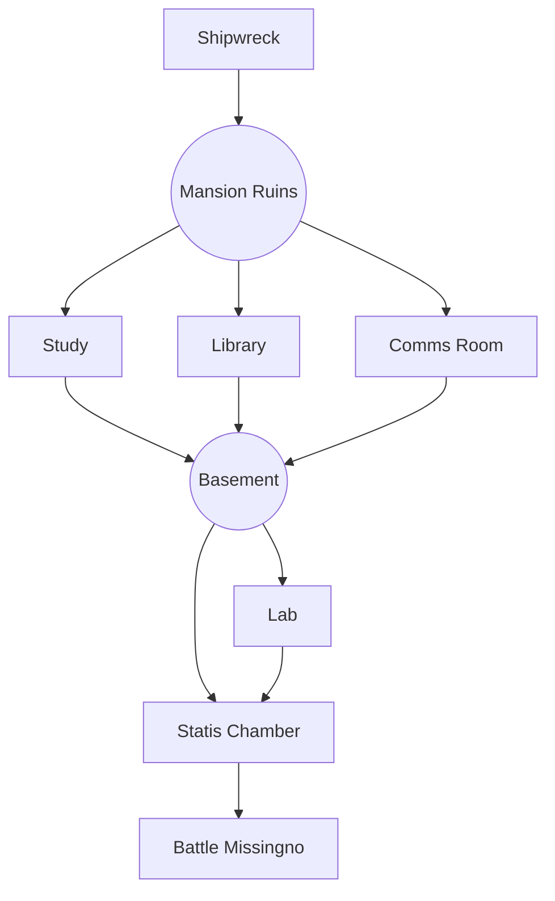

---
categories:
  - Pokerole
  - Modules
doku: Cinnabar
postdate: 2022-08-16
tags:
  - rpgs
  - modules
  - pokerole
description: A Pokerole 2.0 Module centered around a shipwreck at an abandoned mansion on Cinnabar Island...
image: Pasted image 20250604161508.png
---
# Cinnabar 

{: w="100" .right}

This is a **Horror** themed module for Pokerole 2.0 for 2-4 players. The module makes use of a Homebrew simply entitled Sanity Table to capture a Call of Cthulhu type feel to the game. The module is meant to be self contained and played on a dark and stormy night. Characters for the module should be **Ace Rank** and can have two **Ace Rank** Pokemon.

The tone of this module is dark and could potentially end in the characters dying (or "Blacking out"). That said, the ending of the module can be easily adjusted to have a happier outcome as required, to just enjoy the scares on the journey. 

> Player Summary
> You'll be playing an experienced Trainer taking a boat from Pallet Town to Cinnabar Island for your own reasons or goals. No matter what you intended to do once you arrive, you'll find when you do you're only option is to enter the ruins of the Cinnabar Mansion where things are not what they seem...
{: .prompt-tip }

# For the Storyteller

**[Click Here for the Module text itself.]()**

[The Sanity Table used in this module is found here.]() It has a description of how it works on the page. Look out for the below callouts in the module text for when to roll them. 

> Sanity Roll
> 
{: .prompt-tip }

> A Note on Formatting
> In the module, you'll find various formatting styles. Callout blocks like these can be imagined as sidebars. *Italic text* can be read as GM notes and tips. `Code blocks` contain rolls the players will need to make, in the format of `attribute+skill`. If the code block has a `x#` at the end, that means the minimum number of successes is that number, not one. 
{: .prompt-tip }
## NPCs

| Name  | Sex | Pokemon | Notes        |
| ----- | --- | ------- | ------------ |
| Daisy | F   | N/a     | Boat Captain | 

## Story Summary 

The story is carved into a handful of sections. The first section has the players on their boat to Cinnabar when a storm hits. The party must survive a **Shipwreck** as the boat smashes into rocky shores due to the storm. Their injured captain will direct them to the Cinnabar Mansion on a hill to call for help. 

The next section has the PCs exploring the **Cinnabar Mansion.** There are three encounters contained in this section. 

- The Study contains a Mewtwo creation Journal (Verbatim from the game) as a red herring for the weird stuff happening in the Mansion.
- The Library contains the key to the secret basement entrance, as well as Missingno Kabutops that attack the players. 
- The Radio Room contains a note about the equipment being moved to the basement, and a surprise attack by a Missingno Aerodactyl. 

The players, after solving the Statue puzzle (or being helped along by MissingNo), move onto the **Basement** section. This is the final section and is split into two encounters. 

- In the Lab, the players can find out that the scientists who made Mewtwo created something else that was far more dangerous, then they encounter a strange phenomenon. 
- In the statis chamber that once held Mewtwo the players find MissingNo and must fight to survive or escape. **Be sure to read ahead to this encounter!** *There are various options depending on the difficulty and tone you want for the finale.*

