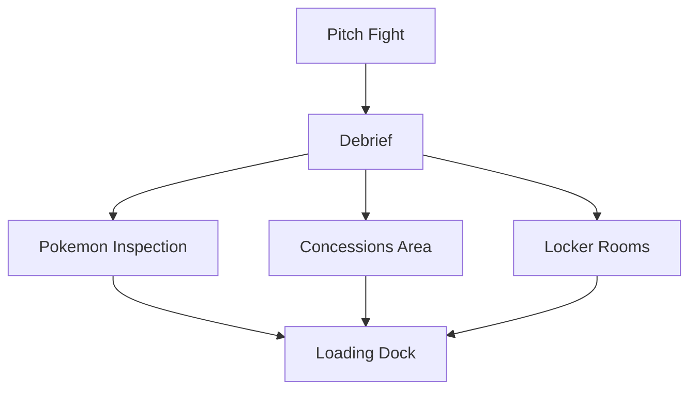

---
categories:
  - Pokerole
  - Modules
doku: ShadowsOverTheStadium
postdate: 2022-12-11
tags:
  - rpgs
  - modules
  - pokerole
description: A Pokerole 2.0 Module dealing with an outbreak of Shadow Pokemon at a large Tournament.
image: Pasted image 20250604164733.png
---
# Shadows Over the Stadium

{: w="100" .right}

This a Pokerole 2.0 module that leverages a [Shadow Pokemon Homebrew](https://docs.google.com/document/d/1gjZg8YFX_rrdIzhuq8ZaDnu2Kl8ZCJvyKxsbCHa4Its/edit) written by Flintlocke98 on the Pokerole discord. The module takes place entirely in a Stadium where Shadow Pokemon have appeared. Following an initial fight, the players will help investigate how the pokemon got into the stadium.It can take place in an existing campaign or as a one shot.

Players will be characters at Ace Rank with two Ace rank Pokemon. They should be playing combat experienced trainers, as combat is involved in the module.

> Player Summary
> You're attending the first every Galar style stadium tournament in Goldenrod City. When the first Pokemon are thrown out to the field everyone is surprised to find the Pokemon are Shadow Pokemon, no one more so than their trainers. They begin to rampage as the Stadium devolves into panic, and someone has to help those trainers before they get hurt...
{: .prompt-tip }
# For the Storyteller

**[Click Here for the Module text itself.]()**

> A Note on Formatting
> In the module, you'll find various formatting styles. Callout blocks like these can be imagined as sidebars. *Italic text* can be read as GM notes and tips. `Code blocks` contain rolls the players will need to make, in the format of `attribute+skill`. If the code block has a `x#` at the end, that means the minimum number of successes is that number, not one. 
{: .prompt-tip }
## NPCs

| Name      | Sex | Pokemon            | Notes        |
| --------- | --- | ------------------ | ------------ |
| Alan      | M   | [SotS Charizard]() |              |
| Elina     | F   | [SotS Beartic]()   |              |
| Remington | M   | [SotS Gengar]()    |              |
| Annabelle | F   | [SotS Luxray]()    |              |
| Lucas     | M   |                    |              |
| Layla     | F   |                    |              |
| Alice     | F   |                    |              |
| Charles   | M   | [SotS Rhyperior]() | League Staff |

## Story Summary

Team Cipher has infiltrated the "Health Check" the stadium staff does on pokemon before they fight in the tournament. They put the competitor's Pokemon through the shadow pokemon process without their trainers knowing so that when the trainers release them in battle, it will cause chaos. The vast majority of the Pokemon however, were gathered and put in a truck in the loading dock on the lowest level of the Stadium. Team Cipher's point man is Charles, a League Official who used to be a spy for Team Rocket and he will be the one to drive the truck out.

The story starts on a large battle in the stadium with shadow pokemon unintentionally released by their trainers. After the battle, Charles will recruit the players to help investigate different locations in the stadium for clues about how the pokemon became shadow pokemon.

Clues in each location lead to the either the other locations listed by Charles, or to the loading dock. The first location they're asked to look at is the health check station, which is blocked by rubble they'll have to pass. The second is the locker rooms where they can interview the other competitors about what the've seen. The third is looking at the concession area, where the staff and and attendees are waiting to leave after lockdown. 

The clues should lead the party to the loading dock where they'll catch Charles leaving. He'll release a horde of shadow pokemon to keep the players from stopping his Rhyperior from drilling him an escape route. This fight closes out the module.