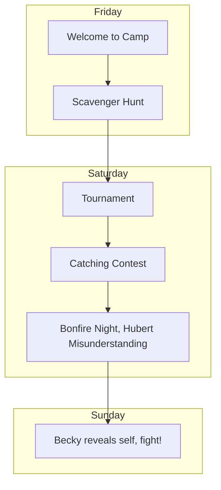

---
categories:
- Pokerole
- Modules
doku: Pokexplorers
dokuflags: null
postdate: 2024-03-05
tags: rpgs modules pokerole
---

#pokexplorers/campaign

# Pokexplorer's Summer Camp!

*[Pokexplorer's is also available in book format!](http://127.0.0.1:4000/obsidian/pokexplorers.pdf)*

*Counselor Becky art on your right provided by Kinta on the Pokerole Discord, thank you so much!*

{: w="300" .right}

Pokexplorer's Summer Camp is a short adventure designed by Willowlark for the Pokerole 2.0 system. It's specifically designed for new GMs and new players to learn how the Pokerole system plays. The adventure should take no more than two sessions to complete and can be used as an introduction to a full length campaign or simply as a learning experience. All the Pokemon, asides from the players, are pregenerated and included in the Module for you.

While there is no substitute for players and GMs alike reading the rulebook, this Pokerole Cheat Sheet can be used like a "DM Screen" while playing. It's an excellent reference for Players and GMs alike!

> Player Introduction!
> 
> Players will be campers at Pokexplorer's Summer Camp, attending a weekend of Pokemon and Camping related activities! Despite all the fun the campers are having, there's something suspicious brewing behind the scenes... 
> 
{: .prompt-tip }
Players will be at the **Beginner Rank**, as will their **One (1) Pokemon** Partner. Any pokemon can be technically selected by players, but a Pokemon that has a Suggested Rank in the Pokedex of Beginner or Starter is recommended. 

Players should be of a similar age, but what age campers should be is not specified anywhere. The simplest option is kids or young teenagers (10~14) who are the usual age group for summer camp, but you could absolutely rework the module to be for an adult summer camp/getaway if you’d like. 

*Remember to have your players apply the right age bonuses when creating characters!*

|                  | Location Information Pages |                     |
| ---------------- | -------------------------- | ------------------- |
| [Cabin Corner]() | [Campfire Circle]()        | [Combat Clearing]() | 

# Storyteller Eyes Only

**[Click here for the module text itself.]()**
Below are some reference tables and high level story information to get you started.

> A Note on Formatting
> In the module, you'll find various formatting styles. Callout blocks like these can be imagined as sidebars. *Italic text* can be read as GM notes and tips. `Code blocks` contain rolls the players will need to make, in the format of `attribute+skill`. If the code block has a `x#` at the end, that means the minimum number of successes is that number, not one. 
{: .prompt-tip }
## NPCs

| Name          | Sex | Pokemon                | Notes                                                                                                                     |
|:------------- |:--- |:---------------------- |:------------------------------------------------------------------------------------------------------------------------- |
| [Becky]()     | F   | [Becky's Snorlax]()    | A Peppy, high energy girl whose one of the camp counsolers, and secretly a Team Rocket Recuruiter!                        |
| [Hubert]()    | M   | N/a                    | A quiet and reserved camp counselor with bangs in his face. Acts suspiciously, but he's just shy and actually quiet sweet |
| [Cooper]()    | M   | [Cooper's Petilil]()   | The Mom Friend, Sweet and easy to get along with                                                                          |
| [Roman]()     | M   | [Roman's Joltik]()     | Geeky, Woodsy, likes Bugs, little chaotic                                                                                 |
| [Jameson]()   | M   | [Jameson's Shuppet]()  | Here entirely to tell scary stories, loves scary things                                                                   |
| [Alice]()     | F   | [Alice's Purrloin]()   | Track Star, this is her break from sports                                                                                 |
| [Valentina]() | F   | [Valentina's Ponyta]() | Feminine AF, likes baking, most excited for cooking                                                                       |
| [Caroline]()  | F   | [Caroline's Piplup]()  | Rich girl, too much baggage, not mean but awkward                                                                         |
| [Ethan]()     | M   | [Ethan's Houndour]()   | Stocky boy, rude and mean                                                                                                 |

## Story Summary

The story is broken up into a handful of major sections. There are questions blocks like this one,

> Questions
> 
> 
{: .prompt-tip }
That give you a few questions to ask the players to encourage roleplay in the scenes between each major section. Play out any scenes you'd like in the in between times before transitioning to the next scene. 

---

The first section deals with arriving at camp and introducing the PCs characters to each other.

The second section is the **Scavenger Hunt**, which is designed as a series of Skill Challenges to introduce PCs to how they can use their Skills and the general rolling mechanics of system.

The third section is the **Tournament**, which is a series of battles so the PCs can give one on one battling a try. This can be lengthy though, so alternatively you can run it as a series of individual battles between campers, rather than a full Tournament.

The fourth section is a **Capture Contest**. Here players are given the chance to battle and catch a wild pokemon, meant to introduce PCs to the mechanics around catching pokemon. 

The remaining two sections relate to the **Twist** of this story. Through out earlier sections, the PCs are presented with Counselor [Hubert]() acting suspiciously and sneaking away into the woods. During a campfire, the PCs will have a chance to confront him only to discover he's been helping some wild pokemon reunite with their friends.

After the misunderstanding is cleared up and the PCs go to sleep, the true twist appears. The morning they're supposed to leave camp [Becky]() reveals she's actually an agent for Team Rocket who wants to forcibly recruit the campers! This leads to a **Brawl/Raid Battle** where all the PCs must defeat Becky's Pokemon together to complete the adventure.

There is a side plot about the NPC [Ethan](), who is a bully in the camp. There's a few scenes written in about his mean actions, and he is willing to join Team Rocket in the finale. Dealing with him more or less can be up to the group playing the adventure. 

---

This flowchart shows the adventure beat by beat as well as which events take place on which days of the weekend.

