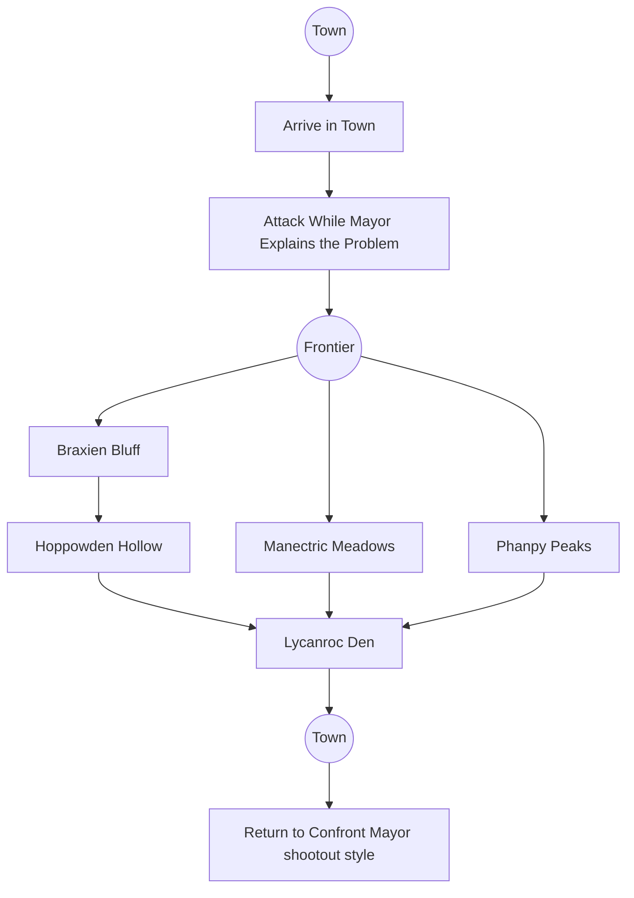

# Pokerole: Unova's Wild West!

This is a module set in the past of the Pokemon world, meant to invoke the feel of Pokemon: Legends Arceus. Unlike PLA, this game takes place in the Wild West! The module should cover one long session or two-three shorter ones, depending on how much the players explore. Key details include

- The module assumes guns aren't a thing, mostly because it's meant to emulate anime/PLA tone.
- Trainers are not common and most people consider them dangerous. 
- Trainers can have **up to two Pokemon** with them at the start of the game, and both can be up to **Amateur rank**. 
- Trainers can be targeted by Pokemon at any time, they are considered to always be in the fray. (They do not need to be included in Initiative if they don't intend to do more than order their Mon about) 

> Player Introduction
> Your character is a rarity in the Wild West, a Pokemon trainer. You've found a request, a telegram that was sent out to every corner of the country that was pinned to train bulletin boards everywhere. The request, which you've chosen to answer, reads as follows: 
> 
> > Help Request in Littlebank Town STOP
> > Wild pkmn attacking Town STOP
> > Looking for Pkmn trainers to drive them off STOP
> > Contact Mayor Sherman Sheppard Upon arrival STOP
> > Cash Reward STOP 
{: .prompt-tip }
# For the Storyteller

**[Click here for the module text itself.]()**

> A Note on Formatting
> In the module, you'll find various formatting styles. Callout blocks like these can be imagined as sidebars. *Italic text* can be read as GM notes and tips. `Code blocks` contain rolls the players will need to make, in the format of `attribute+skill`. If the code block has a `x#` at the end, that means the minimum number of successes is that number, not one. 
{: .prompt-tip }

There are two maps for this module. The first is of [Littlebank]() Town, a small frontier town that has called for aid. The second is of the [Frontier]() surrounding it, made up as if it was a hand drawn map. The map of Littlebank isn't really necessary, but the Frontier map should be available as a handout. 

## Story Summary

The request was send out by [Sherman Sheppard](), the mayor of [Littlebank](). Lycanroc have been attacking the town, it's fields, and their wagons. People are scared and Mayor Sheppard is a beloved leader whose calling in strangers to help out of his own pocket. The PCs will see an attack on the town when they arrive and Sheppard will send them into the frontier to find the Lycanroc den. 

The twist, once the party navigate the frontier to find the Lycanroc, is that Mayor Sheppard's railroad expansion is preventing the Lycanroc from resting, making them angry and upset. The expected finale is the party return to town and confront Sheppard, who has been hiding the fact he has a Pokemon this whole time. 

| NPCs                 | Sex | Pokemon                                             | Notes                                         |
| -------------------- | --- | --------------------------------------------------- | --------------------------------------------- |
| [Sherman Sheppard]() | M   | [Sheppard's Magmortor](), [Sheppard's Electivire]() | The Mayor of Littlebank and a Railroad baron. |
| [Wilson Downs]()     | M   | [Wilson's Machamp]()                                | The Mayor's right hand man.                   |
| [Sophia Walter]()    | F   |                                                     | The Mayor's secretary.                        |

The story is broken up into a few sections. It begins with the party arriving in Littlebank and **finding Mayor Sheppard**. They'll meet with him and be able to ask about the telegram and job they're being asked to do. 

The second section starts when their interview with Sheppard is interrupted by **Lycanroc attack** on a man returning to town. The PCs are expected to drive the Lycanroc off. 

The third section is a **series of encounters** that occur on the routes through the [Frontier]() as the party searches for the Lycanroc's den. On 

- [Braxien Bluff]() has some Braxien and a Delphox surround the PCs, but they're willing to negotiate to let the trainers pass. This is the the X in southwest. 
- [Hippowden Hollow]() involves the players rescuing a man from a Hippowden's sandy den. This is the western X.
- [Manectric Meadows]() has the players being hunted by a group of Manectric while traveling through open fields. This is the center most X.
- [Phanpy Peaks]() puts the players traveling through a series of valleys and Phanpy chase after them, rolling from the peaks. This is the eastern X.

The fourth section is the **Lycanroc Den**, where the players will not only find the Lycanroc, but the railroad construction site where [Wilson Downs]() is in charge. 

The final section of the story is (presumably) the return to Littlebank where the party confronts Wilson and Sheppard in a mexican stand off pokemon battle. 

